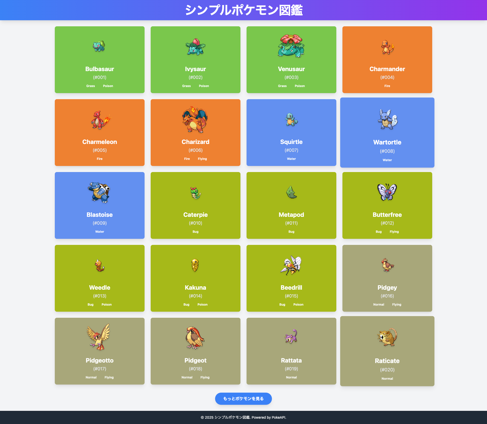
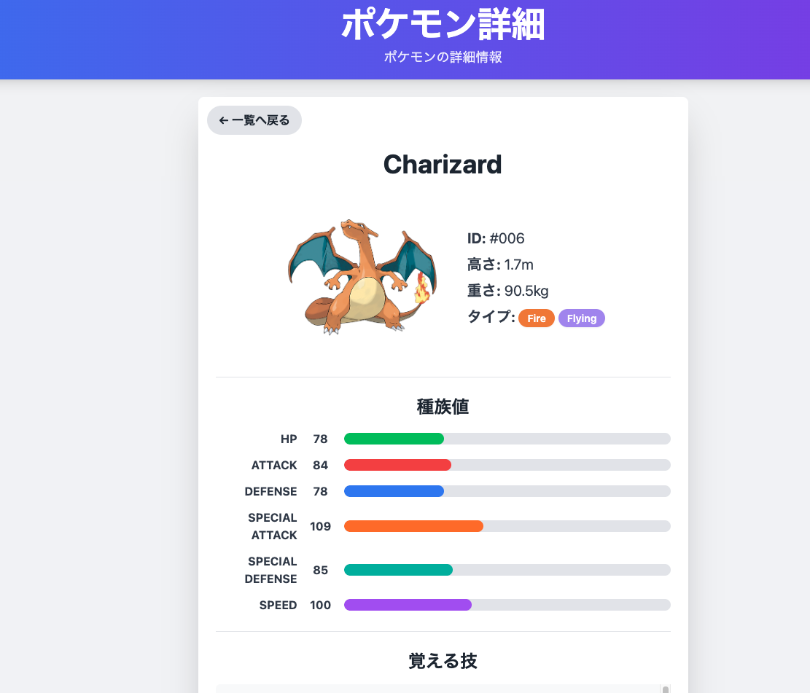

# ポケモン図鑑アプリケーション

## 概要

このプロジェクトは、[PokeAPI](https://pokeapi.co/) を利用してポケモンの情報を閲覧できるシンプルなWebアプリケーションです。
非同期通信（`fetch`, `async/await`）やDOM操作、基本的なUI/UXの考慮を実践的に学ぶために開発しました。

## デモ




## 主な機能

* **ポケモンのリスト表示**:
    * PokeAPIからポケモンの概要リストを取得し、カード形式で一覧表示します。
    * 「もっと見る」ボタンによるページネーション（無限スクロール風）機能を実装しています。
* **各ポケモンの詳細情報表示**:
    * リストからポケモンを選択すると、そのポケモンの詳細ページへ遷移します。
    * ID、タイプ、高さ、重さ、覚える技のリスト、種族値（HP, 攻撃など）といった詳細情報を表示します。
* **動的なUIデザイン**:
    * ポケモンのメインタイプに合わせて、詳細カードの背景色やタイプバッジの色を動的に変更します。
* **ユーザー体験の配慮**:
    * データ取得中のローディングスピナー表示や、エラー発生時のメッセージ表示、多重リクエスト防止のためのフラグ管理 (`isFetching`) を行い、ユーザーに分かりやすいフィードバックを提供します。

## 使用技術

* **フロントエンド**:
    * HTML5
    * CSS3 (Tailwind CSS)
    * JavaScript (Vanilla JS)
* **API**:
    * PokeAPI (RESTful API)
* **開発ツール**:
    * Vite (開発サーバー、ビルドツール)
    * Git / GitHub (バージョン管理)

## 環境構築と実行方法

このプロジェクトをローカル環境でセットアップし、実行するための手順です。

1.  **リポジトリのクローン**:
    ```bash
    git clone [あなたのGitHubリポジトリのURLをここに貼り付けてください]
    cd [クローンしたリポジトリのディレクトリ名]
    ```
2.  **依存関係のインストール**:
    ```bash
    npm install
    # または yarn install
    ```
3.  **開発サーバーの起動**:
    ```bash
    npm run dev
    # または yarn dev
    ```
    ブラウザが自動的に開き、`http://localhost:XXXX/` のようなURLでアプリケーションが表示されます。
4.  **ビルド (本番環境向け)**:
    ```bash
    npm run build
    # または yarn build
    ```
    `dist` ディレクトリに、デプロイ可能な静的ファイルが生成されます。

## こだわった点・学んだこと

* **非同期処理の体系的な理解**: `async/await` 構文を深く理解し、APIからのデータ取得（一覧と詳細）における非同期処理の流れと、`await` による処理の待機を効果的に実装しました。`fetchPokemonList` で概要を取得後、`for...of` ループ内で `fetchPokemonDetail` を個別に `await` することで、各ポケモンの詳細データを確実に取得・表示する手順を確立しました。
* **効率的なDOM操作**: `document.getElementById()`, `appendChild()`, `innerHTML` といったメソッドを使い、JavaScriptで動的にHTML要素を生成し、画面に反映させる技術を習得しました。特に、配列の `map` メソッドを活用して、複数のタイプや技を簡潔なコードでHTMLに変換する手法を実践しました。
* **堅牢なUI/UX設計**:
    * データ取得中にはローディングスピナーを表示し、ユーザーに待機を促す工夫を凝らしました。
    * APIエラー時やデータがない場合のエラーメッセージ表示により、ユーザーが状況を把握しやすくしました。
    * `isFetching` フラグを導入し、データ取得中の多重リクエストを防止することで、アプリケーションの安定性とユーザー体験の向上を図りました。
* **モジュール性のあるコード構造**: `api.js` (API通信), `ui.js` (UI関連ヘルパー), `constants.js` (定数定義) のようにファイルを分割し、それぞれの責務を明確にすることで、コードの可読性、保守性、再利用性を高めました。
* **Tailwind CSSによるスタイリング**: ユーティリティファーストのCSSフレームワークであるTailwind CSSを効果的に利用し、迅速かつ一貫性のあるデザインを実装しました。特に、`tailwind.config.js` でカスタムカラーを定義し、ポケモンタイプに合わせた動的なカラーリングを実現しました。
* **URLとデータ連携**: `window.location.href` を用いて詳細ページへ遷移する際に、URLのクエリパラメータ（`?id=XXX`）でポケモンのIDを渡し、詳細ページ側でそのIDを解析して対応する情報を表示するデータ連携の仕組みを理解・実装しました。
* **JSONデータ構造の解析**: PokeAPIから返されるJSONデータの複雑なネスト構造を`console.log`などを活用して分析し、必要なプロパティ（例: `pokemon.types[0].type.name`, `moveInfo.move.name`）に正確にアクセスする方法を習得しました。

## 今後の展望
このアプリケーションをさらに発展させるために、以下の機能追加や改善を検討しています。

* **ポケモンの検索・フィルタリング機能の追加**
    * タイプや名前での絞り込みなど、より高度な検索オプションを実装。
* **詳細ページでの進化系統の表示**: ポケモンの進化ツリーを視覚的に表示し、関連するポケモンへのナビゲーションを提供。
* **弱点ポケモンの表示とナビゲーション**:
    * 表示中のポケモンのタイプに応じた弱点タイプを判別。
    * その弱点タイプを持つポケモンを関連ポケモンとして表示し、クリックで詳細ページへ遷移できるようにする。
* **お気に入り登録機能**: ユーザーが好きなポケモンをローカルストレージやデータベース（例: **PostgreSQL** など）に保存・管理できる機能。
* **簡易バトル機能**: 好きなポケモンを選んで仮想的なバトルを行い、タイプ相性を考慮した勝敗をシミュレートする機能。
* **多言語対応（日本語化）**: アプリケーション内のテキストを日本語で表示できるようにし、より広範なユーザーに対応。
* **データ永続化の強化**: 現在のAPIデータに加え、ユーザーのお気に入り情報などを永続的に保存するために、**サーバーサイド（Laravel）とデータベース（PostgreSQLなど）** を活用したバックエンドの構築を検討。
* レスポンシブデザインのさらなる改善（より多くのデバイスサイズへの対応）。
* UIアニメーションの追加によるユーザー体験の向上。

---